# Página Web Responsive

Proyecto de página web responsive para la asignatura de Lenguaje de Marcas.

Primer Curso de DAW Presencial 23/24

Autores: Francesc Barbón Cursach y Francesc Sorà Quevedo

## Estructura del repositorio

El Repositorio tiene la siguiente estructura:

__Pagina web__   
&nbsp; &nbsp;     |  
&nbsp; &nbsp;     |-----__Contents__  
&nbsp; &nbsp;     |&nbsp; &nbsp; &nbsp; &nbsp; &nbsp; &nbsp;         |  
&nbsp; &nbsp;     |&nbsp; &nbsp; &nbsp; &nbsp; &nbsp; &nbsp;         |------__Imagenes__  
&nbsp; &nbsp;     |  
&nbsp; &nbsp;     |-----__Camiseta.html__  
&nbsp; &nbsp;     |-----__Index.html__  
&nbsp; &nbsp;     |-----__Jugadores.html__  
&nbsp; &nbsp;     |-----__Sobre_nosotros.html__  
&nbsp; &nbsp;     |-----__suscripcion.html__  
&nbsp; &nbsp;     |-----__css.css__  
&nbsp; &nbsp;     |-----__js.js__  
&nbsp; &nbsp;     |-----__README.md__  

## Tecnologías utilizadas

Para la realización de este proyecto se han utilizado las siguientes tecnologías:
1. __VSCODE__: Visual Studio Code es un editor de codigo fuente personalizable desarrollado por Microsoft. Es compatible con varios lenguajes de programación, por cual cosa es la plataforma que hemos utilizado para realizar nuestro proyecto.
2. __GitHub__: Se trata de una plataforma de desarrollo colaborativo basado en el sistema de control de versions _Git_. Se basa en la creación de repositorios para la gestión de proyectos. Para controlar la integridad del codigo se pueden crear ramas (branch) las cuales son "copias" de la original pero que pueden ser modificadas de forma independiente y una vez realiado el trabajo y testeado el codigo se pueden fusionar con la rama original para añadir los cambios de forma segura.

## Características de la web

La web está basada en una página de un equipo de e-Sports (deportes electrónicos).  
Consta de 5 páginas:  
- Una pagina inicial des de la cual se pueden ver las últimas noticias del equipo. Durante la evolución de la web se le ha ido dotando de funcionalidades. 
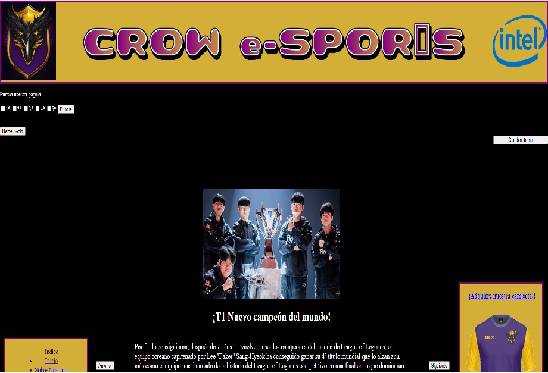

Como se puede ver en la imagen anterior a la izquierda se encuentra un menú de navegación desde el cual podemos acceder al resto de páginas de la web. De formar alternativa clicando sobre el logo del equipo que se encuentro en el encabezamiento podemos volver a la página inicial. En la esquina superior izquierda se encuentra la encuesta de satisfacción y el botón para hacerse socio y en la esquina derecha un botón para cambiar la web a un tema mas claro. Los botones a ambos lados de las noticias nos permiten ir navegando entre ellas de forma interactiva. 
A la derecha se ve el logo de una camiseta, si clicamos sobre el nos aparecera la página siguiente:   
  
- Página de venta de camisetas  

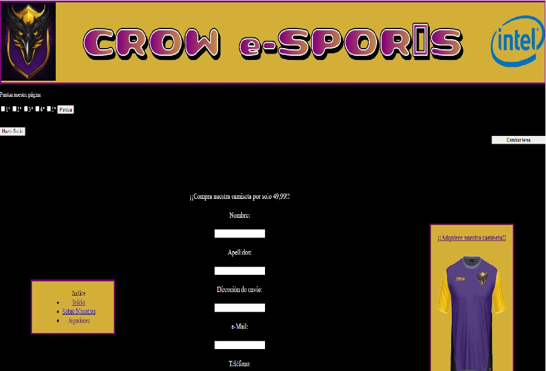 
   
 En esta página encontramos un formulario que debemos rellenar con nuestros datos para obtener la camiseta del equipo. Los campos del formulario están limitados mediante expresiones regulares. El resto de elementos como el botón de cambio de tema, la encuesta y el botón para hacerse socio se mantienen en todas la páginas de la web.
  
- Página de información (Sobre Nosotros)  

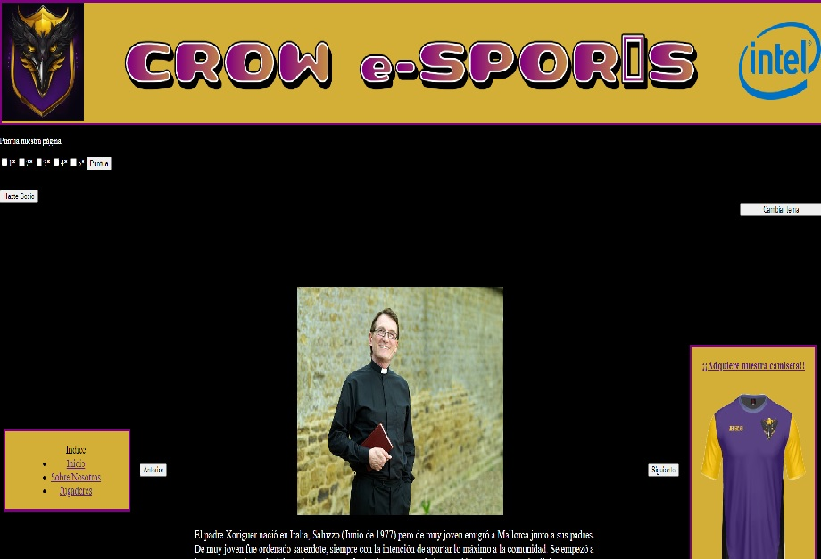  
  
Esta página contiene información sobre el equipo directivo y organizativo, así como contexto sobre la creación del equipo. Al igual que en la página de inicio cuenta con unos botones con los que ir pasando de una publicación a otra.

- Página de jugadores del equipo  
  
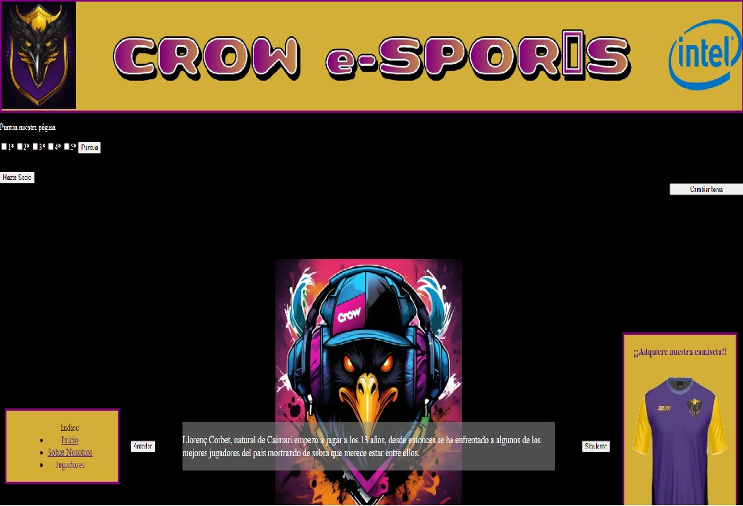  

Esta página presenta la misma estructura y comportamiento que las páginas anteriores con el añadido que al pasar el cursor por encima de la imágenes de los jugadores una pestaña se muestra que amplía la información sobre el jugador en cuestión.

- Resgistro de socios

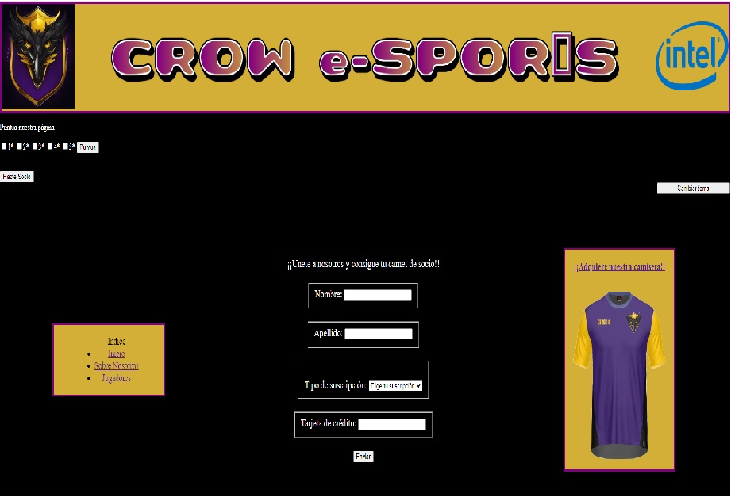 

En esta página se muestra un formulario con el que el usuario puede hacerse socio del club con lo que obtiene un carnet de socio con un número de socio y un estética diferente en función del nivel de suscripción que se elija (normal, colaborador o premium).

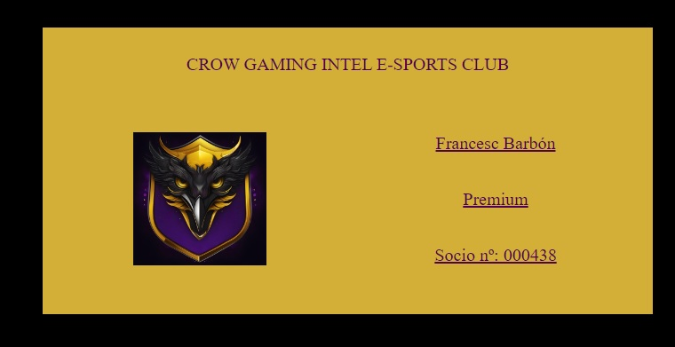 
  
## Evolución del proyecto  

1. __Versión 1.0__: Inicialmente nos centramos en crear un fondo que fuese común para toda la web, por esto decidimos un patrón de colores que se repetiria durante todo el proyecto para darle cohesión. El siguiente fue diseñar la estructura y pensar donde irían colocados los elementos de la página, por eso optamos por un esqueleto tipo encuadrado donde tanto la cabecera como los menus (a los lados) fuesen siempre visibles y lo que se fuera moviendo fuera el contenido principal de la página. Una vez decidido también el logo fuimos probando tamaños hasta que dimos con la siguiente estructura

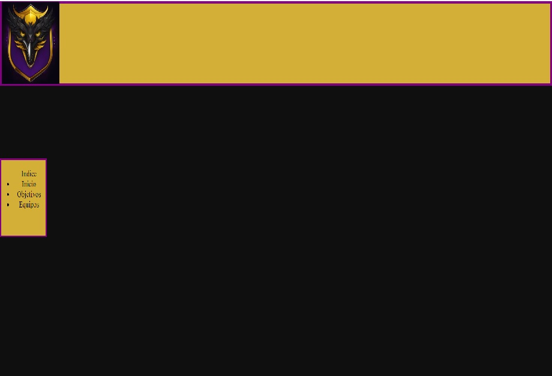  
  
2. __Versión 2.0__: El siguiente paso fue la creación del resto de las páginas que conformarían la web, así como poner en funcionamiento el menú para navegar entre ellas  
  
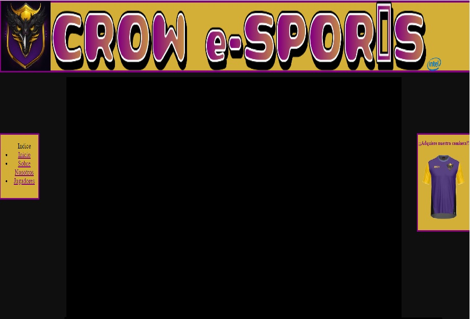  
  
3. __Versión 3.0__: En esta versión implementamos dos media queries fijas para dos anchuras de pantalla diferentes sin utilizar flexbox i rellenamos el contenido de las diferentes pàginas.
  
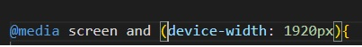  

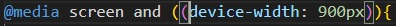 

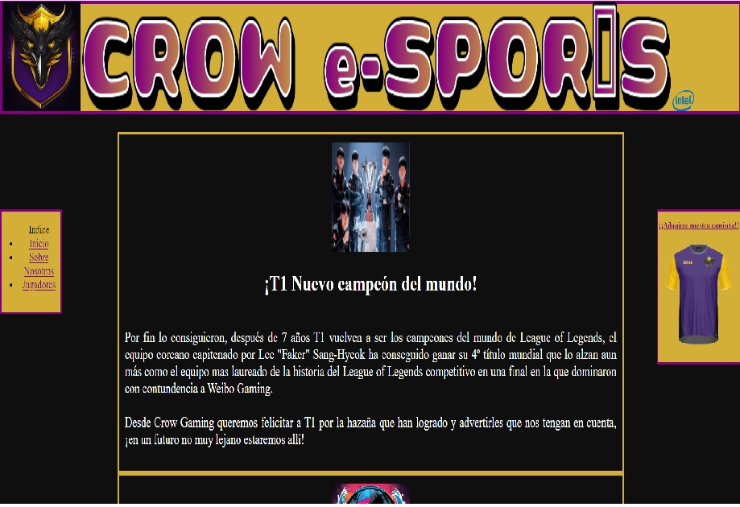 
  
4. __Versión 4.0__: En esta versión pasamos todo el contenido a flex y añadimos media queries para otras dos resoluciones  
  
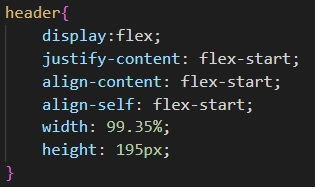  
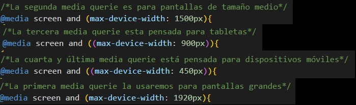  

4. __Version 4.1__: Version actualizada en la que se ha mejorado el archivo css readaptando los contenidos y reubicando ciertos botones para que la distribución sea mas intuitiva para cada una de las resoluciones soportadas.

Resolución de pantalla

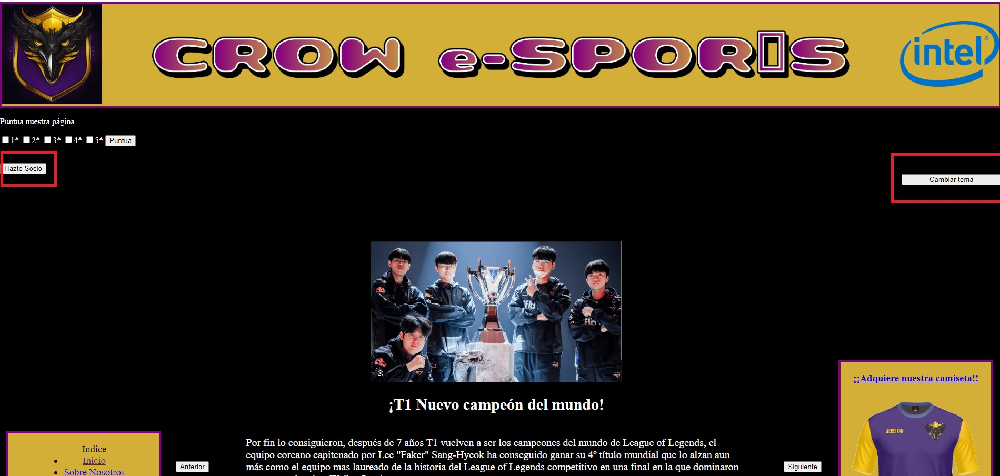

Resolución de dispositivo móvil

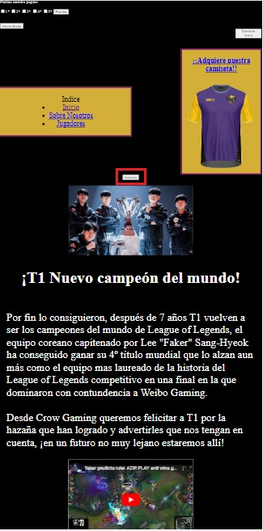

5. __Version 5.0__: En esta última versión se han añadido los elementos que dotan de interactividad a la web con el usuario en forma de encuestas de satisfacción, formularios de registro de usuario, formularios de compra de merchandising o elementos estéticos interactivos como carruseles de imagenes o imagenes adaptativas.
A continuación se indica la lista de mejoras añadidas:

    - Botón de cambio de estilo: Se encuentra en la esquina superior derecha de la página. Al pulsarlo el fondo de la web pasa a ser mas claro. El color que se eligió no es el blanco ya que el gris combina mejor con la eleccion de colores original.

    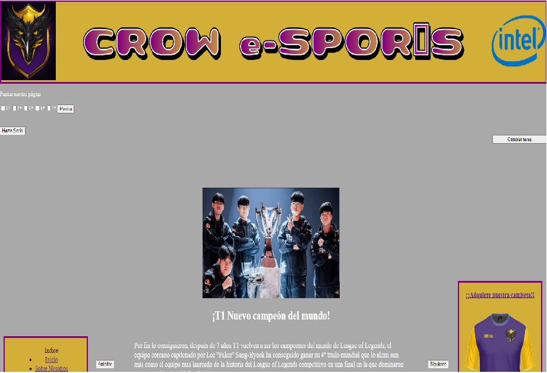

    - Encuesta de satisfacción: Muestra una media de la puntuación de 1 a 5 que nos da la gente que visita la web

     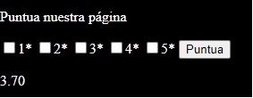

    - Carrusel de imágenes: Tanto las noticias de la página principal como los artículos de "sobre nosotros" han cambiado pasando de ser estáticos a mostrarse de uno en uno y pudiendo pasar entre ellos mediante dos botones que permiten ir a la siguiente noticia y volver a la anterior

    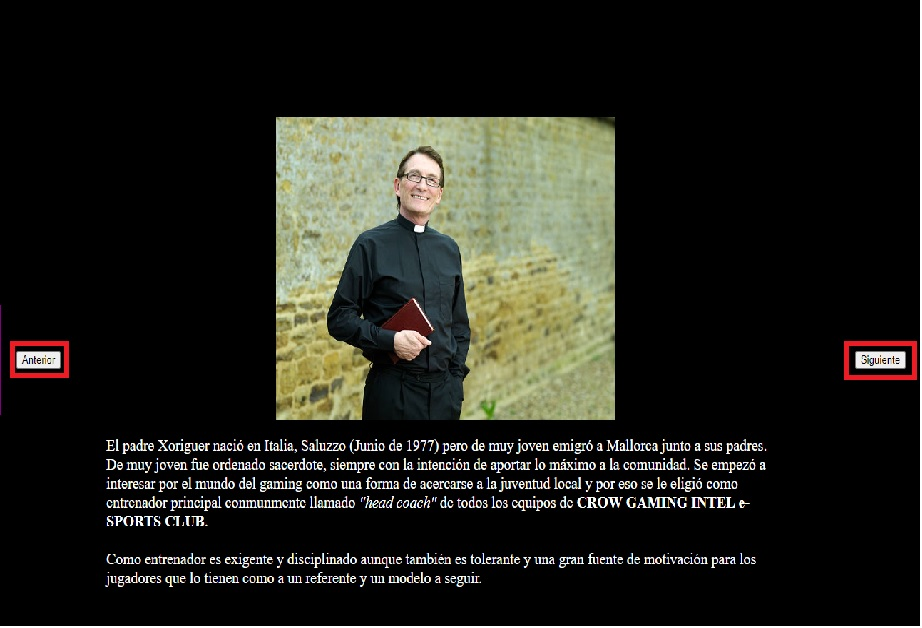

    - Botón de suscripción: En la esquina superior izquierda se encuentra el botón que nos redirige a la página de suscripción donde mediante un formulario el usuario puede registrarse como socio.

    - Página de compra: Se ha ampliado la funcionalidad de la págida de compra de camisetas mediante un formulario el usuario puede comprar una camiseta del equipo a traves de varias plataformas de pago.

    (Estos 2 últimos puntos ya cuentan con imágenes en la sección de características)
  

## Repartición de tareas  
  
El trabajo realizado por cada uno se ve reflejado en esta tabla de excel que tambien añadiremos al repositiorio.

Refleja el trabajo total realizado desde el inicio del proyecto 
  
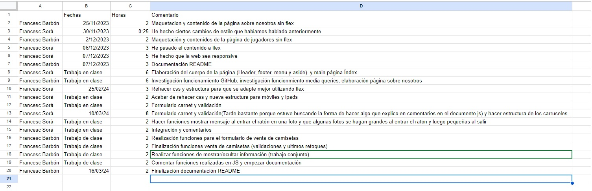  

  

